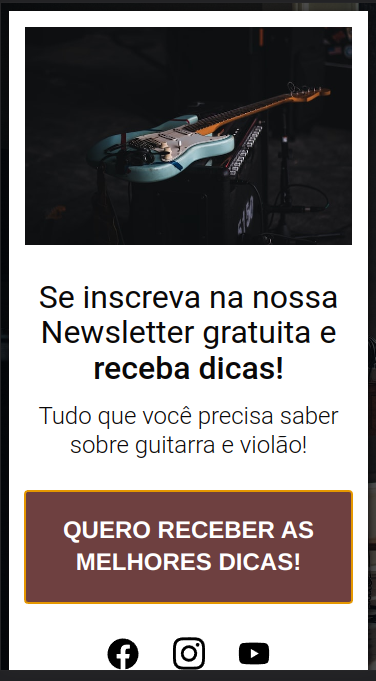
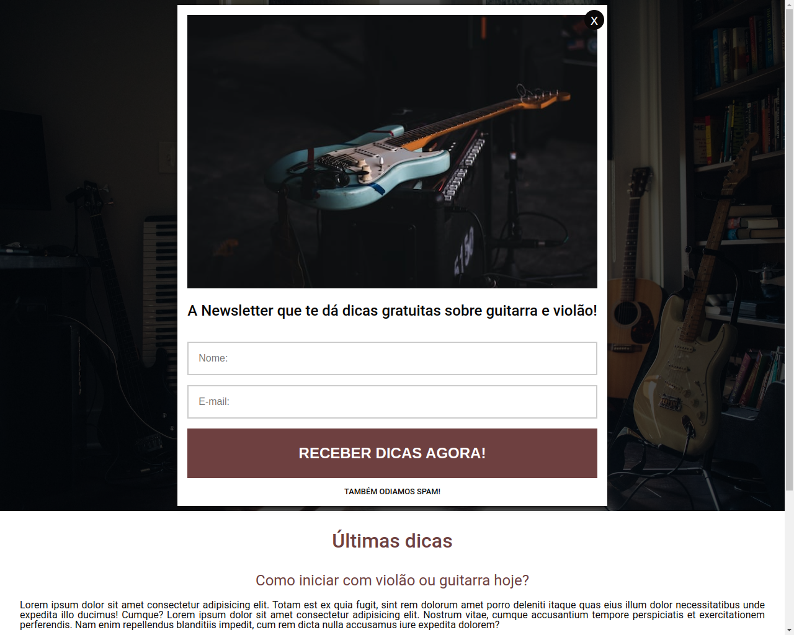

# Guitar Capture Page

- O projeto foi desenvolvido com Html, Css e JavaScript.

## Índice

- [Visão Geral](#visao-geral)
  - [A ideia](#a-ideia)
  - [Screenshot](#screenshot)
  - [Links](#links)
  - [Como rodar o projeto](#como-rodar-o-projeto)
- [Meu processo](#meu-processo)
  - [Construído com](#construido-com)
  - [O que eu aprendi](#o-que-eu-aprendi)
- [Autor](#autor)

## Visao Geral

### A ideia

A ideia foi fazer uma página de captura de uma Newsletter.

### Screenshot





### Links

- URL do repositório: [Código](https://github.com/thiagoa-martins/guitar-capture-page)

### Como rodar o projeto

- Acesse o site e preencha o formulário: [Site](https://thiagoa-martins.github.io/guitar-capture-page/)

## Meu processo

### Construido com

- Marcação HTML5 semântica
- Propriedades personalizadas de CSS
- Flexbox
- Primeiro fluxo de trabalho para desktop
- JavaScript
- Validação de inputs com Regex

### O que eu aprendi

Aprendi a validar com expressões regulares, implementei usabilidade e deixei a página mais acessível ao usuário.

```html
<div class="subscribe-newsletter">
    <div class="container">
        <form id="form">
            <button class="newsletter-close" id="close" aria-label="Fechar">x</button>

            

            <h2 class="title">
                A Newsletter que te dá dicas gratuitas sobre
                guitarra e violão!
            </h2>
            
            <fieldset id="enter-data">
                <input type="text" id="username" placeholder="Nome:">
                <label class="message" for="username"></label>
                <input type="email" id="email" placeholder="E-mail:">
                <label class="message" for="email"></label>

                <button class="tips btn">Receber dicas agora!</button>

                <label class="spam">Também odiamos spam!</label>
            </fieldset>

            <div class="message-success">Obrigado!!! Inscrição realizada com sucesso! =)</div>
        </form>
    </div>
</div>
```

```js
const validateEmail = inputEmail => {
    const emailRegex = /^(?=.*[\@])[a-zA-Z0-9\@]{10,256}$/;
    const emailIsValid = emailRegex.test(inputEmail.value);
    
    if (!emailIsValid) {
        errorFeedback(inputEmail);
    } else {
        successFeedback(inputEmail);
    }
};
```

## Autor

- Github - [thiagoa-martins](https://github.com/thiagoa-martins)
- Linkedin - [thiagoa-martins](https://www.linkedin.com/in/thiagoa-martins/)
